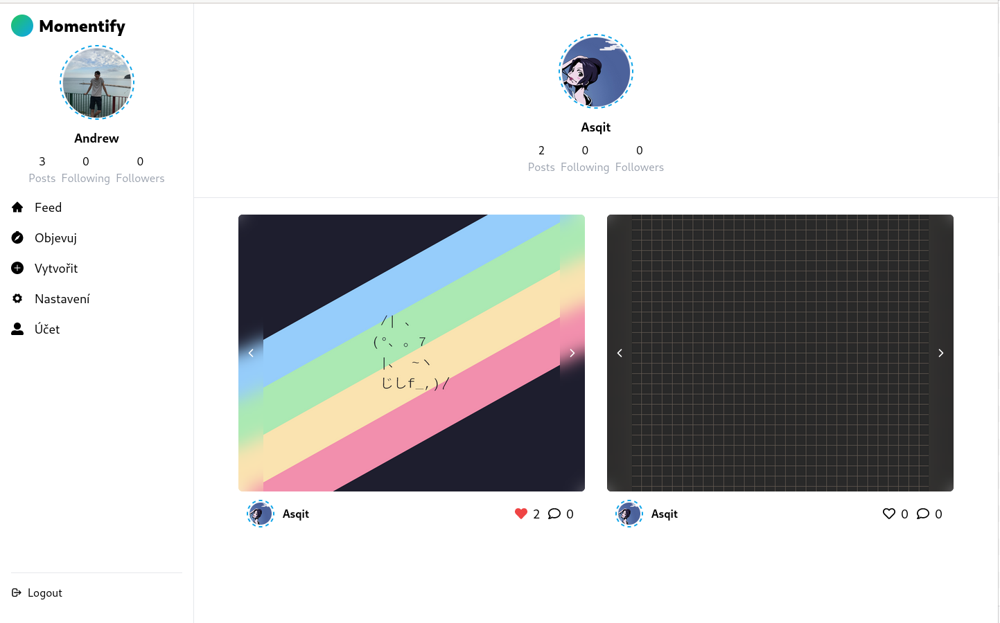

# Momentify 

Momentify is my social-application project made with: `React`, `TypeScript`, `Tailwind CSS`, `i18Next`, `Redux-Toolkit`, `Prisma`, `Express.js`, `Node.js`, `JWT`. In applications, users should be able to: Create posts, like & comment posts, follow/unfollow other users.

## Available scripts

### Client-side
1. format - formats all source code with prettier by prettier configuration in the root of the project
2. dev - starts a vite development server
3. build - will generate `dist` folder with current build

### Server-side
1. format - formats all source code with prettier with prettier config. defined at root of the project 
2. dev:prepare - installs all dependecies and generates a new `PrismaClient`
3. dev - will start a development instance of the node application.
4. build - transpiles all `TypeScript` sources into vanilla `JavaScript`
