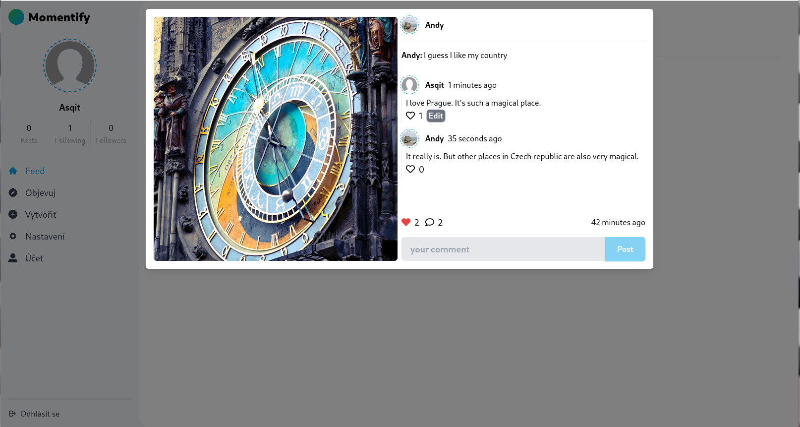

# Momentify

Momentify is a platform for sharing your moments with others. This is `MERN` stack application made for learning purposes, it is not meant to be production level application.
Application supports: dark/light theme, mobile friendly, caching data, localization and uses `JWT` for authentication.

## Available Scripts

    
more details

### Client

1. `dev` - run a development server
2. `build` - transpilles source into browser understandable code
3. `format` - prettier format entire client with config from root file

### Server

1. `dev:prepare` - installs dependencies
1. `dev` - run a development server
1. `prod` - run transpiled application
1. `build` - transpilles source into node.js understandable code
1. `format` - prettier format entire serer with config from root file

## Tech Stack

more details

### Client

1. TypeScript (source-code)
2. React (UI)
3. Redux-Toolkit with Query (state management and data fetching)
4. Tailwind CSS (styling)
5. i18next (localization)
6. Yup / Formik ( form validation)
7. vite, ts + swc (bundling / compiling)

### Server

1. TypeScript (source-code)
2. Express.js (routing)
3. node:http (http server)
4. winston (logging)
5. Prisma (ORM)
6. MongoDB (database)
7. Multer (Multi-part FormData)
8. Joi (request validation)
9. jsonwebtoken (JWT)
10. nodemailer (emailing)

## Screenshots

    
more details

